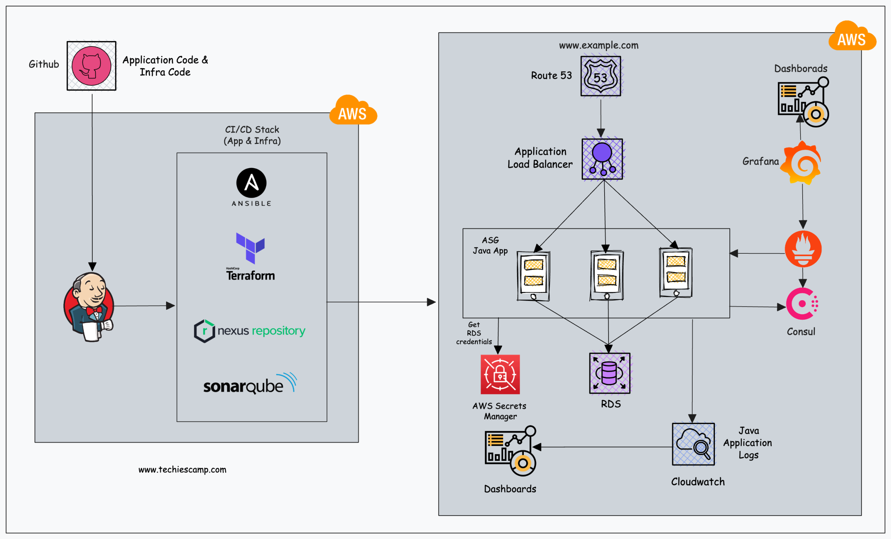
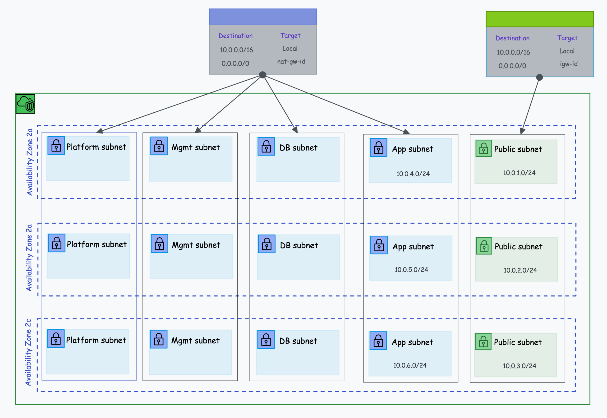

# AWS VPC APPLICATION DESIGN 

To design a VPC, the first thing you should have is an application and its infrastructure requirements, We will take example of an application and its requirements to design the VPC network.

This is design of the Infrastructure

In the given architecture, there are four categories of applications.
1. Web Application (Java App)
2. Automation Tools (App/Infra CI/CD)
3. Platform Tools (Prometheus, Grafana)
4. Managed Services 

## Web Application
Web applications are actively developed by the development team, in our case, its an application publicly available for end-user 

## Automation Tools 
CI/CD tools are essential in every project that involves applications.

## Platform Tools 
Next, we have platform tools like prometheus, grafana, consul that will be used for monitoring and service discovery purposes 

## Managed Services
We are using the RDS MySQL service for our Database requirement. It is a managed database service.

This is AWS VPC Topology

## Public Subnets 

| Subnet Name  | Availability Zone  | CIDR Block | Type |     
| ------------ | ------------ | ------------ | ------- |
| Prod-Web-Public-2a | us-west-2a	 | 10.0.1.0/24	 | Public |
| Prod-Web-Public-2b | us-west-2b	 | 10.0.2.0/24	 | Public |
| Prod-Web-Public-2c | us-west-2c	 | 10.0.3.0/24	 | Public |

## Application Subnets

| Subnet Name  | Availability Zone  | CIDR Block | Type |     
| ------------ | ------------ | ------------ | ------- |
| Prod-App-Private-2a | us-west-2a	 | 10.0.4.0/24	 | Private |
| Prod-App-Private-2b | us-west-2b	 | 10.0.5.0/24	 | Private |
| Prod-App-Private-2c | us-west-2c	 | 10.0.6.0/24	 | Private |

## Database Subnets 

| Subnet Name  | Availability Zone  | CIDR Block | Type |     
| ------------ | ------------ | ------------ | ------- |
| Prod-DB-Private-2a | us-west-2a	 | 10.0.7.0/24	 | Private |
| Prod-DB-Private-2b | us-west-2b	 | 10.0.8.0/24	 | Private |
| Prod-DB-Private-2c | us-west-2c	 | 10.0.9.0/24	 | Private |

## Management Subnets

| Subnet Name  | Availability Zone  | CIDR Block | Type |     
| ------------ | ------------ | ------------ | ------- |
| Prod-Mgmt-Private-2a | us-west-2a	 | 10.0.10.0/24	 | Private |
| Prod-Mgmt-Private-2b | us-west-2b	 | 10.0.11.0/24	 | Private |
| Prod-Mgmt-Private-2c | us-west-2c	 | 10.0.12.0/24	 | Private |

## Platform Subnets 

| Subnet Name  | Availability Zone  | CIDR Block | Type |     
| ------------ | ------------ | ------------ | ------- |
| Prod-Platform-Private-2a | us-west-2a	 | 10.0.13.0/24	 | Private |
| Prod-Platform-Private-2b | us-west-2b	 | 10.0.14.0/24	 | Private |
| Prod-Platform-Private-2c | us-west-2c	 | 10.0.15.0/24	 | Private |

## Route Table Design 

| Subnet | Destination CIDR | Target | 
| --- | --- | --- |
| Public | 0.0.0.0/0 | Internet Gateway | 
| App| 0.0.0.0/0 | Nat Gateway |
| Database | 0.0.0.0/0 | Nat Gateway |
| Management | 0.0.0.0/0 | Nat Gateway |
